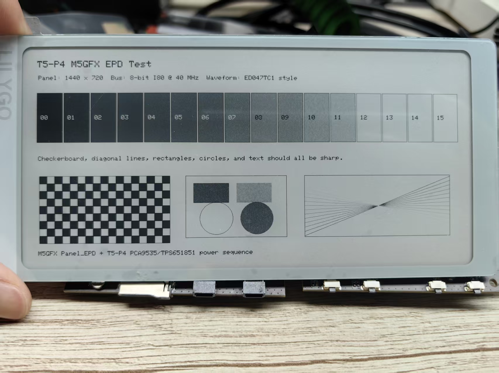

# M5GFX EPD Test

This ESP-IDF example drives the T5-P4 E-Paper panel through the managed `m5stack/m5gfx` component declared in `main/idf_component.yml`.

It uses the same ED047TC1-style grayscale waveform path as the T5S3 reader project, but with the T5-P4 V0.2 board wiring:

- 1440 x 720 panel
- 8-bit EPD data bus on GPIO27..GPIO34
- CKH/STH/LEH/CKV/STV on GPIO24/GPIO25/GPIO26/GPIO13/GPIO48
- PCA9535 + TPS651851 power sequence
- Horizontal mirror compensation matching the reference FastEPD `MIRROR_X` panel flag



Build from this directory:

```sh
idf.py set-target esp32p4
idf.py build flash monitor
```
