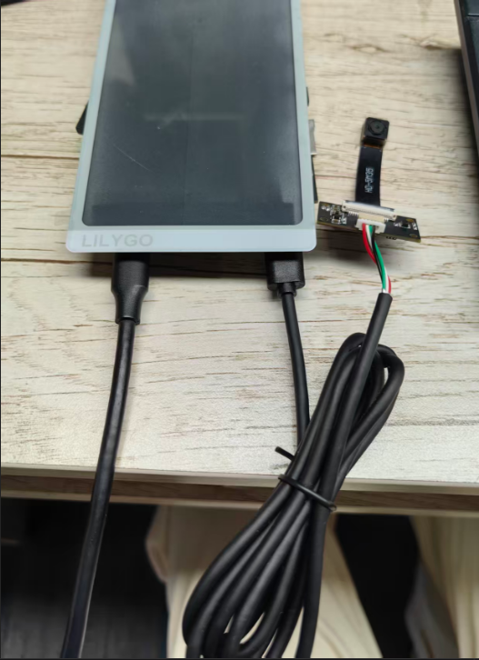
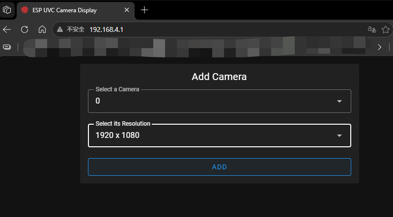
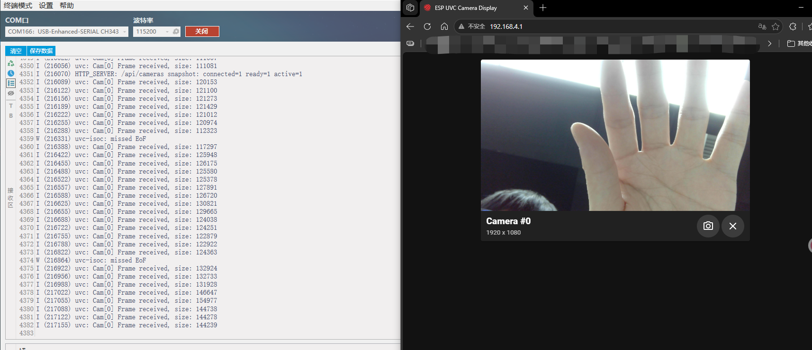

# usb_host_hub_dual_camera

This example is based on [usb_host_uvc](https://components.espressif.com/components/espressif/usb_host_uvc). It connects one or more external **USB UVC** cameras to the T5-P4 and previews MJPEG video through a web page.

- MJPEG preview only
- Multi-camera support through a USB hub
- Save the current frame from the web page

## Scope

This example follows the **USB UVC Host** path and explicitly does not include:

- Onboard MIPI cameras (`OV2710` / `SC2336` / `OV5645`)
- `SGM38121` camera power control flow

If you need `OV2710 + SGM38121`, use `examples/camera_wifi_stream`.

## Hardware Requirements

- Development board: LilyGo T5-P4 E-Paper (`esp32p4`)
- One or more external UVC cameras. A self-powered USB hub is optional but recommended for multi-camera setups.
- Connection:
  - Connect the board USB input/power port to host power.
  - Connect the board USB OTG port to the UVC camera or USB hub.
- Before using Wi-Fi, make sure the onboard ESP32-C6 is flashed with `esp-hosted` slave firmware.
  - Reference: `docs/esp-hosted-c6-Slave.md`

The ESP32-P4 USB Host signals are `USB_DP=GPIO50` and `USB_DM=GPIO49`.

## Test Setup



## Build and Flash

```bash
idf.py -C examples/usb_host_hub_dual_camera set-target esp32p4
idf.py -C examples/usb_host_hub_dual_camera build
idf.py -C examples/usb_host_hub_dual_camera -p <PORT> flash
```

## Web UI Access

Safari is not recommended for the streaming page used by this example.

Connect to the default AP SSID and open the default IP address:

- Default AP SSID: `ESP-USB-UVC-Demo`
- Default AP IP: `192.168.4.1`
- Open in browser: `http://192.168.4.1`

Select a camera and resolution.


Click `ADD` to start receiving the video stream.


## Log Output

You may see logs like this:

```text
ESP-ROM:esp32p4-eco2-20240710
Build:Jul 10 2024
rst:0x1 (POWERON),boot:0xf (SPI_FAST_FLASH_BOOT)
SPI mode:DIO, clock div:1
load:0x4ff33ce0,len:0x17c4
load:0x4ff2abd0,len:0x1010
load:0x4ff2cbd0,len:0x3420
entry 0x4ff2abda
ESP-ROM:esp32p4-eco2-20240710
Build:Jul 10 2024
rst:0x7 (HP_SYS_HP_WDT_RESET),boot:0xf (SPI_FAST_FLASH_BOOT)
SPI mode:DIO, clock div:1
load:0x4ff33ce0,len:0x17c4
load:0x4ff2abd0,len:0x1010
load:0x4ff2cbd0,len:0x3420
entry 0x4ff2abda
I (28) boot: ESP-IDF v5.4.3 2nd stage bootloader
I (28) boot: compile time Apr 13 2026 14:00:50
I (28) boot: Multicore bootloader
I (30) boot: chip revision: v1.0
I (31) boot: efuse block revision: v0.3
I (35) qio_mode: Enabling QIO for flash chip WinBond
I (39) boot.esp32p4: SPI Speed      : 80MHz
I (43) boot.esp32p4: SPI Mode       : QIO
I (47) boot.esp32p4: SPI Flash Size : 16MB
W (51) boot.esp32p4: CPU has been reset by WDT.
I (55) boot: Enabling RNG early entropy source...
I (60) boot: Partition Table:
I (62) boot: ## Label            Usage          Type ST Offset   Length
I (69) boot:  0 nvs              WiFi data        01 02 00009000 00006000
I (75) boot:  1 phy_init         RF data          01 01 0000f000 00001000
I (82) boot:  2 factory          factory app      00 00 00010000 00100000
I (88) boot:  3 storage          Unknown data     01 82 00110000 000e0000
I (96) boot: End of partition table
I (98) esp_image: segment 0: paddr=00010020 vaddr=40090020 size=3c7d0h (247760) map
I (144) esp_image: segment 1: paddr=0004c7f8 vaddr=30100000 size=00068h (   104) load
I (146) esp_image: segment 2: paddr=0004c868 vaddr=4ff00000 size=037b0h ( 14256) load
I (152) esp_image: segment 3: paddr=00050020 vaddr=40000020 size=89844h (563268) map
I (243) esp_image: segment 4: paddr=000d986c vaddr=4ff037b0 size=0f568h ( 62824) load
I (256) esp_image: segment 5: paddr=000e8ddc vaddr=4ff12d80 size=02fd8h ( 12248) load
I (263) boot: Loaded app from partition at offset 0x10000
I (264) boot: Disabling RNG early entropy source...
I (276) hex_psram: vendor id    : 0x0d (AP)
I (276) hex_psram: Latency      : 0x01 (Fixed)
I (276) hex_psram: DriveStr.    : 0x00 (25 Ohm)
I (277) hex_psram: dev id       : 0x03 (generation 4)
I (282) hex_psram: density      : 0x07 (256 Mbit)
I (286) hex_psram: good-die     : 0x06 (Pass)
I (290) hex_psram: SRF          : 0x02 (Slow Refresh)
I (295) hex_psram: BurstType    : 0x00 ( Wrap)
I (299) hex_psram: BurstLen     : 0x03 (2048 Byte)
I (303) hex_psram: BitMode      : 0x01 (X16 Mode)
I (308) hex_psram: Readlatency  : 0x04 (14 cycles@Fixed)
I (313) hex_psram: DriveStrength: 0x00 (1/1)
I (317) MSPI DQS: tuning success, best phase id is 0
I (494) MSPI DQS: tuning success, best delayline id is 17
I (495) esp_psram: Found 32MB PSRAM device
I (495) esp_psram: Speed: 200MHz
I (496) hex_psram: psram CS IO is dedicated
I (499) cpu_start: Multicore app
I (1452) esp_psram: SPI SRAM memory test OK
I (1461) cpu_start: Pro cpu start user code
I (1461) cpu_start: cpu freq: 360000000 Hz
I (1461) app_init: Application information:
I (1462) app_init: Project name:     usb_hub_dual_camera
I (1467) app_init: App version:      12f6600
I (1471) app_init: Compile time:     May 21 2026 16:24:04
I (1476) app_init: ELF file SHA256:  31c5b786b...
I (1480) app_init: ESP-IDF:          v5.4.3
I (1484) efuse_init: Min chip rev:     v0.1
I (1488) efuse_init: Max chip rev:     v1.99 
I (1492) efuse_init: Chip rev:         v1.0
I (1496) heap_init: Initializing. RAM available for dynamic allocation:
I (1502) heap_init: At 4FF18430 len 00022B90 (138 KiB): RAM
I (1507) heap_init: At 4FF3AFC0 len 00004BF0 (18 KiB): RAM
I (1513) heap_init: At 4FF40000 len 00060000 (384 KiB): RAM
I (1518) heap_init: At 50108080 len 00007F80 (31 KiB): RTCRAM
I (1523) heap_init: At 30100068 len 00001F98 (7 KiB): TCM
I (1529) esp_psram: Adding pool of 32768K of PSRAM memory to heap allocator
I (1536) spi_flash: detected chip: generic
I (1539) spi_flash: flash io: qio
I (1542) host_init: ESP Hosted : Host chip_ip[18]
I (1579) H_API: ESP-Hosted starting. Hosted_Tasks: prio:23, stack: 5120 RPC_task_stack: 5120
I (1579) H_API: ** add_esp_wifi_remote_channels **
I (1581) gpio: GPIO[18]| InputEn: 0| OutputEn: 0| OpenDrain: 0| Pullup: 1| Pulldown: 0| Intr:0 
I (1589) gpio: GPIO[19]| InputEn: 0| OutputEn: 0| OpenDrain: 0| Pullup: 1| Pulldown: 0| Intr:0 
I (1597) gpio: GPIO[14]| InputEn: 0| OutputEn: 0| OpenDrain: 0| Pullup: 1| Pulldown: 0| Intr:0 
I (1606) gpio: GPIO[15]| InputEn: 0| OutputEn: 0| OpenDrain: 0| Pullup: 1| Pulldown: 0| Intr:0 
I (1614) gpio: GPIO[16]| InputEn: 0| OutputEn: 0| OpenDrain: 0| Pullup: 1| Pulldown: 0| Intr:0 
I (1622) gpio: GPIO[17]| InputEn: 0| OutputEn: 1| OpenDrain: 0| Pullup: 0| Pulldown: 0| Intr:0 
I (1632) H_SDIO_DRV: sdio_data_to_rx_buf_task started
I (1636) main_task: Started on CPU0
I (1640) esp_psram: Reserving pool of 32K of internal memory for DMA/internal allocations
I (1647) main_task: Calling app_main()
I (1657) transport: Attempt connection with slave: retry[0]
W (1657) H_SDIO_DRV: Reset slave using GPIO[54]
I (1660) os_wrapper_esp: GPIO [54] configured
I (1664) gpio: GPIO[54]| InputEn: 0| OutputEn: 1| OpenDrain: 0| Pullup: 0| Pulldown: 0| Intr:0 
I (3193) sdio_wrapper: SDIO master: Slot 1, Data-Lines: 4-bit Freq(KHz)[40000 KHz]
I (3193) sdio_wrapper: GPIOs: CLK[18] CMD[19] D0[14] D1[15] D2[16] D3[17] Slave_Reset[54]
I (3197) sdio_wrapper: Queues: Tx[20] Rx[20] SDIO-Rx-Mode[1]
I (3234) gpio: GPIO[15]| InputEn: 0| OutputEn: 0| OpenDrain: 0| Pullup: 1| Pulldown: 0| Intr:0 
I (3236) gpio: GPIO[17]| InputEn: 0| OutputEn: 0| OpenDrain: 0| Pullup: 1| Pulldown: 0| Intr:0 
I (3240) sdio_wrapper: Function 0 Blocksize: 512
I (3244) sdio_wrapper: Function 1 Blocksize: 512
I (3348) H_SDIO_DRV: Card init success, TRANSPORT_RX_ACTIVE
I (3348) transport: set_transport_state: 1
I (3348) transport: Waiting for esp_hosted slave to be ready
I (3432) H_SDIO_DRV: SDIO Host operating in STREAMING MODE
I (3432) H_SDIO_DRV: Open data path at slave
I (3432) H_SDIO_DRV: Starting SDIO process rx task
I (3460) H_SDIO_DRV: Received ESP_PRIV_IF type message
I (3460) transport: Received INIT event from ESP32 peripheral
I (3460) transport: EVENT: 12
I (3462) transport: Identified slave [esp32c6]
I (3466) transport: SDIO mode: slave: streaming, host: streaming
I (3471) transport: EVENT: 11
I (3474) transport: capabilities: 0xd
I (3477) transport: Features supported are:
I (3481) transport:      * WLAN
I (3484) transport:        - HCI over SDIO
I (3488) transport:        - BLE only
I (3491) transport: EVENT: 13
I (3493) transport: ESP board type is : 13 


I (3497) transport: Base transport is set-up, TRANSPORT_TX_ACTIVE
I (3503) H_API: Transport active
I (3506) transport: Slave chip Id[12]
I (3510) transport: raw_tp_dir[-], flow_ctrl: low[60] high[80]
I (3515) transport: transport_delayed_init
I (3519) esp_cli: Registering command: crash
I (3523) esp_cli: Registering command: reboot
I (3527) esp_cli: Registering command: mem-dump
I (3531) esp_cli: Registering command: task-dump
I (3536) esp_cli: Registering command: cpu-dump
I (3540) esp_cli: Registering command: heap-trace
I (3544) esp_cli: Registering command: sock-dump
I (3549) esp_cli: Registering command: host-power-save
I (3554) hci_stub_drv: Host BT Support: Disabled
I (3558) H_SDIO_DRV: Received INIT event
I (3562) H_SDIO_DRV: Event type: 0x22
I (3565) H_SDIO_DRV: Write thread started
I (3632) RPC_WRAP: Coprocessor Boot-up
I (3842) app_wifi: wifi_init_softap finished.SSID:ESP-USB-UVC-Demo password:
I (3965) RPC_WRAP: ESP Event: softap started
I (3993) uvc: USB Host installed. Waiting for devices on USB OTG (GPIO49/GPIO50).
I (3993) usb_mon: USB monitor ready. Waiting for devices on the board USB OTG port.
I (3994) esp_netif_lwip: DHCP server started on interface WIFI_AP_DEF with IP: 192.168.4.1
I (4001) RPC_WRAP: ESP Event: softap started
I (4048) main_task: Returned from app_main()
I (4325) RPC_WRAP: ESP Event: SoftAP mode: station connected with MAC Addr 90:0f:0c:2f:3b:5b
I (4325) app_wifi: station 90:0f:0c:2f:3b:5b join, AID=1
I (4350) esp_netif_lwip: DHCP server assigned IP to a client, IP is: 192.168.4.2
I (4453) usb_mon: USB device enumerated on OTG: addr=1 vid=0x0ac8 pid=0x3460 speed=high-speed dev_class=0xef config=1 interfaces=2 product="W19 HD Webcam" manufacturer="DHZJ-250122-ZW" serial="-"
I (4453) uvc: Device connected
I (4459) usb_mon:   Interface #0 alt=0 class=0x0e subclass=0x01 protocol=0x00 eps=1
I (4462) uvc: Cam[0] uvc_stream_index = 0
I (4469) usb_mon:   Interface #1 alt=0 class=0x0e subclass=0x02 protocol=0x00 eps=0
I (4473) uvc: Pick Cam[0] FORMAT_MJPEG 1280*720@30.0fps
I (4480) usb_mon:   Interface #1 alt=1 class=0x0e subclass=0x02 protocol=0x00 eps=1
I (4485) uvc: Pick Cam[0] FORMAT_MJPEG 2560*1440@30.0fps
I (4493) usb_mon:   Interface #1 alt=2 class=0x0e subclass=0x02 protocol=0x00 eps=1
I (4498) uvc: Pick Cam[0] FORMAT_MJPEG 2592*1944@30.0fps
I (4505) usb_mon:   Interface #1 alt=3 class=0x0e subclass=0x02 protocol=0x00 eps=1
I (4510) uvc: Pick Cam[0] FORMAT_MJPEG 2048*1536@30.0fps
I (4517) usb_mon:   Interface #1 alt=4 class=0x0e subclass=0x02 protocol=0x00 eps=1
I (4522) uvc: Pick Cam[0] FORMAT_MJPEG 800*600@30.0fps
I (4530) usb_mon:   Interface #1 alt=5 class=0x0e subclass=0x02 protocol=0x00 eps=1
I (4535) uvc: Pick Cam[0] FORMAT_MJPEG 640*480@30.0fps
I (4542) usb_mon:   Interface #1 alt=6 class=0x0e subclass=0x02 protocol=0x00 eps=1
I (4547) uvc: Pick Cam[0] FORMAT_MJPEG 1920*1080@30.0fps
I (4554) usb_mon:   Interface #1 alt=7 class=0x0e subclass=0x02 protocol=0x00 eps=1
I (4559) uvc: Drop Cam[0] FORMAT_YUY2 1280*720@7.5fps
I (4567) usb_mon:   Interface #1 alt=8 class=0x0e subclass=0x02 protocol=0x00 eps=1
I (4571) uvc: Drop Cam[0] FORMAT_YUY2 2560*1440@2.0fps
I (4579) usb_mon:   Interface #1 alt=9 class=0x0e subclass=0x02 protocol=0x00 eps=1
I (4584) uvc: Drop Cam[0] FORMAT_YUY2 2592*1944@2.0fps
I (4591) usb_mon:   Interface #1 alt=10 class=0x0e subclass=0x02 protocol=0x00 eps=1
I (4596) uvc: Drop Cam[0] FORMAT_YUY2 2048*1536@5.0fps
I (4603) usb_mon:   Interface #1 alt=11 class=0x0e subclass=0x02 protocol=0x00 eps=1
I (4608) uvc: Drop Cam[0] FORMAT_YUY2 800*600@7.5fps
I (4616) usb_mon: UVC camera with MJPEG support detected on OTG. The camera should appear in the web UI after the UVC driver finishes parsing.
I (4620) uvc: Drop Cam[0] FORMAT_YUY2 640*480@30.0fps
I (4638) uvc: Drop Cam[0] FORMAT_YUY2 1920*1080@2.0fps

```

When cameras stream successfully, the log also prints per-camera frame and mode selection messages.

## Troubleshooting

- If a camera is detected but rejected, confirm it is a real UVC device with MJPEG support because this demo does not handle every USB video format.
- If enumeration is unstable, use a powered hub and verify OTG wiring and power budget.
- If the web page loads but no image appears, check camera mode selection logs and make sure the selected stream index matches a valid MJPEG mode.
